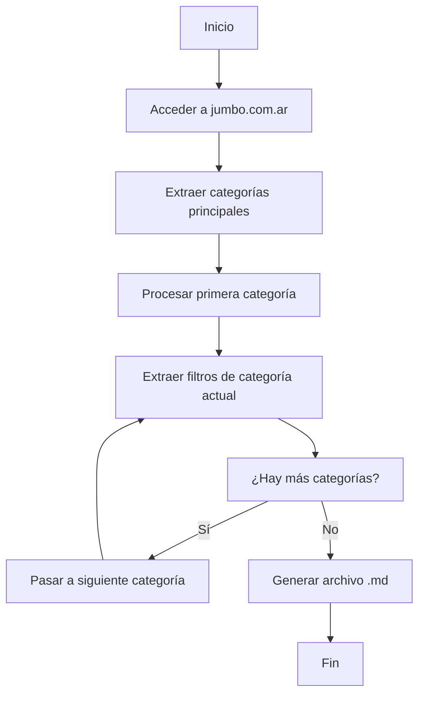

# Especificación Técnica: Script de Extracción de Filtros Jumbo

## Resumen Ejecutivo

Este documento especifica los requerimientos técnicos para desarrollar un script automatizado que extraiga las categorías y filtros del sitio web de Jumbo Argentina, generando una documentación completa en formato Markdown.

## Objetivos del Script

- **Automatización completa**: Eliminar el proceso manual de extracción de filtros
- **Consistencia**: Garantizar que todas las categorías sigan la misma estructura
- **Mantenibilidad**: Fácil actualización cuando cambien las categorías o filtros
- **Documentación**: Generar archivo .md con formato estandarizado

## Arquitectura General del Script

### Flujo Principal


## Especificaciones Técnicas

### 1. Configuración Inicial

#### Dependencias Requeridas
- **Requests**: Para hacer peticiones HTTP
- **BeautifulSoup**: Para parsear HTML
- **Selenium** (opcional): Para contenido dinámico
- **Markdown**: Para generar la documentación

#### Configuración del Navegador
```python
headers = {
    'User-Agent': 'Mozilla/5.0 (Windows NT 10.0; Win64; x64) AppleWebKit/537.36',
    'Accept': 'text/html,application/xhtml+xml,application/xml;q=0.9,*/*;q=0.8',
    'Accept-Language': 'es-AR,es;q=0.9,en;q=0.8',
    'Accept-Encoding': 'gzip, deflate, br',
    'Connection': 'keep-alive',
    'Upgrade-Insecure-Requests': '1'
}
```

### 2. Paso 1: Acceso al Sitio Principal

#### URL Base
- **URL**: `https://www.jumbo.com.ar`
- **Método**: GET
- **Headers**: Configurados para simular navegador real

#### Validación de Acceso
- Verificar código de respuesta HTTP 200
- Confirmar que el contenido se cargó correctamente
- Manejar posibles bloqueos o restricciones

### 3. Paso 2: Extracción de Categorías Principales

#### Localización de Categorías
Las categorías se encuentran en la navegación principal del sitio. Buscar:
- Elementos `<nav>` o `<ul>` con clase de navegación
- Enlaces `<a>` que contengan las URLs de categorías
- Texto de las categorías para nombrado

#### Patrón de URLs
```regex
https://www.jumbo.com.ar/[categoria-nombre]
```

#### Estructura de Datos para Categorías
```python
categories = [
    {
        'name': 'Electro',
        'url': 'https://www.jumbo.com.ar/electro',
        'filters': []  # Se llenará después
    },
    # ... más categorías
]
```

#### Validación de Categorías
- Verificar que cada URL sea accesible
- Confirmar que el nombre de categoría sea válido
- Filtrar categorías no relevantes (como "Ofertas", "Novedades", etc.)

### 4. Paso 3: Procesamiento de Categorías Individuales

#### Loop Principal
```python
for category in categories:
    print(f"Procesando categoría: {category['name']}")
    filters = extract_filters_from_category(category['url'])
    category['filters'] = filters
```

### 5. Paso 4: Extracción de Filtros por Categoría

#### Método de Extracción
Para cada categoría, acceder a su URL específica y extraer:

1. **Filtros Base** (siempre presentes):
   - Categoría
   - Sub-Categoría
   - Tipo de Producto

2. **Filtros Específicos**:
   - Buscar en elementos HTML con clases relacionadas a filtros
   - Extraer texto de opciones de filtro
   - Limpiar y validar nombres de filtros

#### Técnicas de Extracción
- **XPath/CSS Selectors**: Para localizar elementos de filtro
- **Regex**: Para extraer nombres de filtros del HTML
- **JSON Parsing**: Si los filtros están en datos estructurados

#### Ejemplo de Selectores
```python
# Posibles selectores para filtros
filter_selectors = [
    '.filter-item',
    '.facet-option',
    '.filter-option',
    '[data-filter]',
    '.search-filter'
]
```

#### Limpieza de Datos
- Remover "Rangos de precio" (como especificado)
- Eliminar duplicados
- Validar nombres de filtros
- Ordenar alfabéticamente

### 6. Manejo de Errores y Edge Cases

#### Errores HTTP
- **404**: Categoría no encontrada
- **500**: Error del servidor
- **429**: Rate limiting
- **Timeout**: Conexión lenta

#### Estrategias de Recuperación
- Reintentar con delay exponencial
- Usar proxies alternativos
- Continuar con siguiente categoría si una falla

#### Contenido Dinámico
- Detectar si la página usa JavaScript para cargar filtros
- Implementar Selenium como fallback
- Esperar carga completa antes de extraer

### 7. Generación del Archivo Markdown

#### Estructura del Archivo
```markdown
## Categorias
1. Electro: https://www.jumbo.com.ar/electro
2. Hogar: https://www.jumbo.com.ar/hogar-y-textil
...

## Filtros por Categoría

### Electro
**Total de filtros: 28**
-- FiltrosCategory
Categoría
Sub-Categoría
-- Tipo de producto
Tipo de Producto
-- Subfiltros
Capacidad de Lavado
Capacidad de Secado
...
```

#### Función de Generación
```python
def generate_markdown(categories, output_file):
    with open(output_file, 'w', encoding='utf-8') as f:
        # Generar encabezado
        # Generar lista de categorías
        # Generar secciones de filtros
        pass
```

### 8. Logging y Monitoreo

#### Niveles de Logging
- **INFO**: Progreso normal del script
- **WARNING**: Problemas menores (reintentos)
- **ERROR**: Errores críticos
- **DEBUG**: Información detallada para troubleshooting

#### Métricas a Registrar
- Tiempo total de ejecución
- Número de categorías procesadas
- Número de filtros extraídos
- Errores encontrados y resueltos

### 9. Configuración y Parámetros

#### Archivo de Configuración
```yaml
# config.yaml
site_url: "https://www.jumbo.com.ar"
output_file: "categorias_jumbo.md"
max_retries: 3
delay_between_requests: 1
timeout: 30
user_agent: "Custom User Agent String"
```

#### Parámetros de Línea de Comando
```bash
python extract_filters.py --config config.yaml --verbose
```

### 10. Consideraciones de Performance

#### Optimización
- **Conexiones persistentes**: Reutilizar conexiones HTTP
- **Multithreading**: Procesar múltiples categorías en paralelo
- **Caching**: Almacenar resultados intermedios
- **Rate limiting**: Respetar límites del servidor

#### Recursos del Sistema
- **Memoria**: Mantener bajo consumo para listas grandes
- **CPU**: Optimizar parsing de HTML
- **Disco**: Escribir resultados progresivamente

### 11. Testing y Validación

#### Casos de Prueba
- **Categorías válidas**: Verificar extracción correcta
- **Categorías inválidas**: Manejo de errores
- **Contenido dinámico**: Selenium fallback
- **Rate limiting**: Comportamiento con límites

#### Validación de Datos
- Verificar estructura del Markdown generado
- Contar filtros y comparar con expectativas
- Validar URLs de categorías
- Revisar consistencia de nombres

### 12. Mantenimiento y Actualización

#### Monitoreo Continuo
- Alertas cuando cambien las categorías
- Detección de cambios en filtros
- Actualización automática del script

#### Versionado
- Control de versiones del script
- Historial de cambios en categorías
- Backup de datos anteriores

### 13. Seguridad y Ética

#### Consideraciones Éticas
- Respetar robots.txt del sitio
- No sobrecargar el servidor
- Uso legítimo de los datos

#### Medidas de Seguridad
- Rotación de User-Agents
- Manejo de CAPTCHAs
- Detección de bloqueos

### 14. Métricas de Éxito

#### KPIs del Script
- **Tasa de éxito**: Porcentaje de categorías procesadas correctamente
- **Tiempo de ejecución**: Minutos para procesar todas las categorías
- **Precisión**: Porcentaje de filtros extraídos correctamente
- **Mantenibilidad**: Facilidad para actualizar cuando cambie el sitio

### 15. Plan de Implementación

#### Fases de Desarrollo
1. **Fase 1**: Configuración básica y acceso al sitio
2. **Fase 2**: Extracción de categorías principales
3. **Fase 3**: Extracción de filtros por categoría
4. **Fase 4**: Generación del archivo Markdown
5. **Fase 5**: Testing y validación
6. **Fase 6**: Optimización y mejoras

#### Deliverables
- Script Python completamente funcional
- Archivo de configuración
- Documentación de uso
- Tests automatizados
- Archivo Markdown generado

---

## Conclusión

Esta especificación proporciona una guía completa para desarrollar un script robusto y mantenible que automatice la extracción de filtros de Jumbo. El enfoque modular permite fácil mantenimiento y actualización cuando cambie la estructura del sitio web.

**Próximos pasos**: Implementar el script siguiendo esta especificación y probar con datos reales.

---

# 🗺️ Guía de Etapas de Desarrollo

Esta guía divide el desarrollo del script en **7 etapas secuenciales**, cada una con objetivos específicos, tareas detalladas y criterios de aceptación claros.

## 📋 Metodología de Desarrollo

### Principios Generales
- **Desarrollo incremental**: Cada etapa produce un resultado funcional
- **Testing continuo**: Validar cada componente antes de continuar
- **Documentación**: Actualizar documentación en cada etapa
- **Control de versiones**: Commits frecuentes con mensajes descriptivos

### Herramientas de Validación
- **Tests unitarios**: Para funciones individuales
- **Tests de integración**: Para flujos completos
- **Validación manual**: Verificación visual de resultados
- **Logging**: Registro detallado de operaciones

---

## 🚀 Etapa 1: Configuración del Proyecto y Dependencias

### 🎯 Objetivo
Establecer la estructura básica del proyecto y configurar todas las dependencias necesarias.

### 📝 Tareas Específicas

#### 1.1 Crear Estructura de Directorios
```bash
scraper-jumbo/
├── src/
│   ├── __init__.py
│   ├── main.py
│   ├── config.py
│   ├── scraper.py
│   ├── extractor.py
│   └── generator.py
├── tests/
│   ├── __init__.py
│   ├── test_scraper.py
│   ├── test_extractor.py
│   └── test_generator.py
├── docs/
├── config/
│   └── config.yaml
└── logs/
```

#### 1.2 Instalar Dependencias
```bash
pip install requests beautifulsoup4 selenium pyyaml markdown
```

#### 1.3 Configurar Archivo de Configuración
```yaml
# config/config.yaml
site_url: "https://www.jumbo.com.ar"
output_file: "categorias_jumbo.md"
max_retries: 3
delay_between_requests: 1
timeout: 30
user_agent: "Mozilla/5.0 (Windows NT 10.0; Win64; x64) AppleWebKit/537.36"
log_level: "INFO"
```

#### 1.4 Implementar Sistema de Logging
```python
# src/config.py
import logging
import yaml

def setup_logging(log_level='INFO'):
    logging.basicConfig(
        level=getattr(logging, log_level),
        format='%(asctime)s - %(name)s - %(levelname)s - %(message)s',
        handlers=[
            logging.FileHandler('logs/scraper.log'),
            logging.StreamHandler()
        ]
    )
```

### ✅ Criterios de Aceptación
- [ ] Estructura de directorios creada
- [ ] Todas las dependencias instaladas
- [ ] Archivo de configuración funcional
- [ ] Sistema de logging operativo
- [ ] Script básico ejecutable sin errores
- [ ] Tests básicos pasan

### 📊 Entregables
- Estructura completa del proyecto
- Archivo `requirements.txt`
- Archivo `config.yaml` funcional
- Sistema de logging configurado

---

## 🌐 Etapa 2: Acceso Básico al Sitio Web

### 🎯 Objetivo
Implementar la capacidad de acceder al sitio web de Jumbo y manejar respuestas básicas.

### 📝 Tareas Específicas

#### 2.1 Implementar Cliente HTTP
```python
# src/scraper.py
import requests
from .config import load_config

class JumboScraper:
    def __init__(self):
        self.config = load_config()
        self.session = requests.Session()
        self.session.headers.update(self._get_headers())

    def _get_headers(self):
        return {
            'User-Agent': self.config['user_agent'],
            'Accept': 'text/html,application/xhtml+xml,application/xml;q=0.9,*/*;q=0.8',
            'Accept-Language': 'es-AR,es;q=0.9,en;q=0.8',
        }

    def get_page(self, url):
        """Obtener página con manejo de errores"""
        try:
            response = self.session.get(url, timeout=self.config['timeout'])
            response.raise_for_status()
            return response.text
        except requests.RequestException as e:
            logger.error(f"Error accediendo a {url}: {e}")
            return None
```

#### 2.2 Implementar Manejo de Errores Básico
- Capturar excepciones HTTP
- Implementar reintentos automáticos
- Logging de errores

#### 2.3 Crear Tests de Conectividad
```python
# tests/test_scraper.py
def test_basic_connection():
    scraper = JumboScraper()
    content = scraper.get_page("https://www.jumbo.com.ar")
    assert content is not None
    assert "Jumbo" in content
```

### ✅ Criterios de Aceptación
- [ ] Cliente HTTP funcional
- [ ] Acceso exitoso a jumbo.com.ar
- [ ] Manejo básico de errores implementado
- [ ] Tests de conectividad pasan
- [ ] Logging de operaciones HTTP

### 📊 Entregables
- Clase `JumboScraper` funcional
- Tests de conectividad
- Manejo básico de errores HTTP

---

## 📂 Etapa 3: Extracción de Categorías Principales

### 🎯 Objetivo
Extraer la lista completa de categorías principales con sus URLs correspondientes.

### 📝 Tareas Específicas

#### 3.1 Analizar Estructura HTML
- Inspeccionar navegación principal
- Identificar patrones de URLs de categorías
- Localizar elementos de menú

#### 3.2 Implementar Extracción de Categorías
```python
# src/extractor.py
from bs4 import BeautifulSoup

def extract_categories(html_content):
    """Extraer categorías de la página principal"""
    soup = BeautifulSoup(html_content, 'html.parser')

    categories = []
    # Buscar elementos de navegación
    nav_elements = soup.find_all(['a', 'li'], class_=re.compile(r'nav|menu|category'))

    for element in nav_elements:
        href = element.get('href')
        if href and '/categoria' in href:
            name = element.get_text().strip()
            if name and len(name) > 2:
                categories.append({
                    'name': name,
                    'url': f"https://www.jumbo.com.ar{href}",
                    'filters': []
                })

    return categories
```

#### 3.3 Filtrar y Validar Categorías
- Eliminar categorías no relevantes (Ofertas, Novedades, etc.)
- Validar URLs accesibles
- Limpiar nombres de categorías

#### 3.4 Implementar Caching
- Almacenar categorías extraídas
- Evitar re-extracción innecesaria

### ✅ Criterios de Aceptación
- [ ] Extracción exitosa de todas las categorías principales
- [ ] URLs válidas y accesibles
- [ ] Filtrado correcto de categorías irrelevantes
- [ ] Almacenamiento en estructura de datos apropiada
- [ ] Tests de extracción de categorías

### 📊 Entregables
- Función `extract_categories()` funcional
- Lista validada de categorías
- Tests de extracción

---

## 🔍 Etapa 4: Extracción de Filtros por Categoría

### 🎯 Objetivo
Implementar la lógica para extraer filtros de cada categoría individual.

### 📝 Tareas Específicas

#### 4.1 Analizar Estructura de Filtros
- Inspeccionar HTML de páginas de categoría
- Identificar selectores CSS para filtros
- Entender estructura de datos de filtros

#### 4.2 Implementar Extracción de Filtros
```python
# src/extractor.py
def extract_filters(html_content):
    """Extraer filtros de una página de categoría"""
    soup = BeautifulSoup(html_content, 'html.parser')

    filters = []
    base_filters = ['Categoría', 'Sub-Categoría', 'Tipo de Producto']

    # Buscar elementos de filtro
    filter_elements = soup.find_all(['div', 'li', 'span'], class_=re.compile(r'filter|facet'))

    for element in filter_elements:
        filter_text = element.get_text().strip()
        if (filter_text and
            len(filter_text) > 2 and
            filter_text not in base_filters and
            'precio' not in filter_text.lower()):
            filters.append(filter_text)

    # Limpiar y deduplicar
    unique_filters = list(set(filters))
    unique_filters.sort()

    return base_filters + unique_filters
```

#### 4.3 Implementar Procesamiento por Lotes
- Procesar categorías en lotes pequeños
- Implementar delays entre requests
- Manejar rate limiting

#### 4.4 Agregar Validación de Filtros
- Verificar integridad de datos
- Detectar cambios en estructura
- Logging detallado de extracción

### ✅ Criterios de Aceptación
- [ ] Extracción exitosa de filtros de al menos 3 categorías
- [ ] Estructura de datos consistente
- [ ] Filtrado correcto de "Rangos de precio"
- [ ] Manejo de errores en extracción
- [ ] Tests de extracción de filtros

### 📊 Entregables
- Función `extract_filters()` funcional
- Procesamiento por lotes implementado
- Tests de extracción de filtros

---

## 📝 Etapa 5: Generación del Archivo Markdown

### 🎯 Objetivo
Crear el generador que produce el archivo .md final con toda la información extraída.

### 📝 Tareas Específicas

#### 5.1 Implementar Generador Markdown
```python
# src/generator.py
def generate_markdown(categories, output_file):
    """Generar archivo Markdown con categorías y filtros"""

    with open(output_file, 'w', encoding='utf-8') as f:
        # Encabezado
        f.write("# Categorias\n")
        for i, category in enumerate(categories, 1):
            f.write(f"{i}. {category['name']}: {category['url']}\n")
        f.write("\n")

        # Sección de filtros
        f.write("## Filtros por Categoría\n\n")

        for category in categories:
            f.write(f"### {category['name']}\n")
            total_filters = len(category['filters'])
            f.write(f"**Total de filtros: {total_filters}**\n")

            # Filtros base
            f.write("-- FiltrosCategory\n")
            f.write("Categoría\n")
            f.write("Sub-Categoría\n")
            f.write("-- Tipo de producto\n")
            f.write("Tipo de Producto\n")
            f.write("-- Subfiltros\n")

            # Filtros específicos
            for filter_name in category['filters'][3:]:  # Saltar filtros base
                f.write(f"{filter_name}\n")

            f.write("\n")
```

#### 5.2 Implementar Formateo Avanzado
- Alineación consistente
- Encoding UTF-8
- Manejo de caracteres especiales

#### 5.3 Agregar Metadatos
- Timestamp de generación
- Versión del script
- Estadísticas de extracción

### ✅ Criterios de Aceptación
- [ ] Archivo Markdown generado correctamente
- [ ] Formato idéntico al manual existente
- [ ] Encoding UTF-8 correcto
- [ ] Conteos de filtros precisos
- [ ] Tests de generación

### 📊 Entregables
- Función `generate_markdown()` funcional
- Archivo .md de ejemplo generado
- Tests de generación

---

## 🧪 Etapa 6: Testing y Validación

### 🎯 Objetivo
Implementar suite completa de tests y validar el funcionamiento del script.

### 📝 Tareas Específicas

#### 6.1 Tests Unitarios
```python
# tests/test_extractor.py
def test_extract_categories():
    # Test con HTML mock
    pass

def test_extract_filters():
    # Test con HTML de categoría mock
    pass
```

#### 6.2 Tests de Integración
- Test completo del flujo
- Validación de datos end-to-end
- Tests de performance

#### 6.3 Validación Manual
- Comparar resultados con extracción manual
- Verificar precisión de filtros
- Validar formato del Markdown

#### 6.4 Implementar CI/CD Básico
- Tests automáticos en commit
- Linting de código
- Validación de formato

### ✅ Criterios de Aceptación
- [ ] Cobertura de tests > 80%
- [ ] Todos los tests pasan
- [ ] Validación manual exitosa
- [ ] Resultados idénticos a extracción manual
- [ ] CI/CD básico implementado

### 📊 Entregables
- Suite completa de tests
- Reportes de cobertura
- Validación manual documentada

---

## ⚡ Etapa 7: Optimización y Mejoras

### 🎯 Objetivo
Optimizar performance, agregar features avanzadas y preparar para producción.

### 📝 Tareas Específicas

#### 7.1 Optimizaciones de Performance
- Implementar multithreading para categorías
- Optimizar parsing HTML
- Implementar caching inteligente

#### 7.2 Features Avanzadas
- Detección automática de cambios
- Modo incremental de actualización
- Dashboard de monitoreo

#### 7.3 Documentación Final
- README completo del proyecto
- Guía de uso detallada
- Documentación de API

#### 7.4 Preparación para Producción
- Configuración de logging avanzado
- Manejo de credenciales seguras
- Empaquetado del proyecto

### ✅ Criterios de Aceptación
- [ ] Performance mejorada significativamente
- [ ] Features avanzadas implementadas
- [ ] Documentación completa
- [ ] Listo para despliegue en producción

### 📊 Entregables
- Script optimizado y completo
- Documentación final
- Configuración de producción

---

## 📈 Seguimiento de Progreso

### Checklist General
- [ ] Etapa 1: Configuración del Proyecto
- [ ] Etapa 2: Acceso Básico al Sitio Web
- [ ] Etapa 3: Extracción de Categorías
- [ ] Etapa 4: Extracción de Filtros
- [ ] Etapa 5: Generación Markdown
- [ ] Etapa 6: Testing y Validación
- [ ] Etapa 7: Optimización y Producción

### Métricas por Etapa
- **Tiempo estimado**: 2-3 días por etapa
- **Tests requeridos**: Mínimo 5 tests por etapa
- **Documentación**: README actualizado por etapa

### Riesgos y Mitigaciones
- **Rate limiting**: Implementar delays y proxies
- **Cambios en sitio**: Tests de regresión automáticos
- **Dependencias**: Versionado estricto de librerías

---

**Fecha**: Septiembre 2025
**Versión**: 1.1
**Autor**: GitHub Copilot
**Estado**: Guía de Desarrollo Completa
