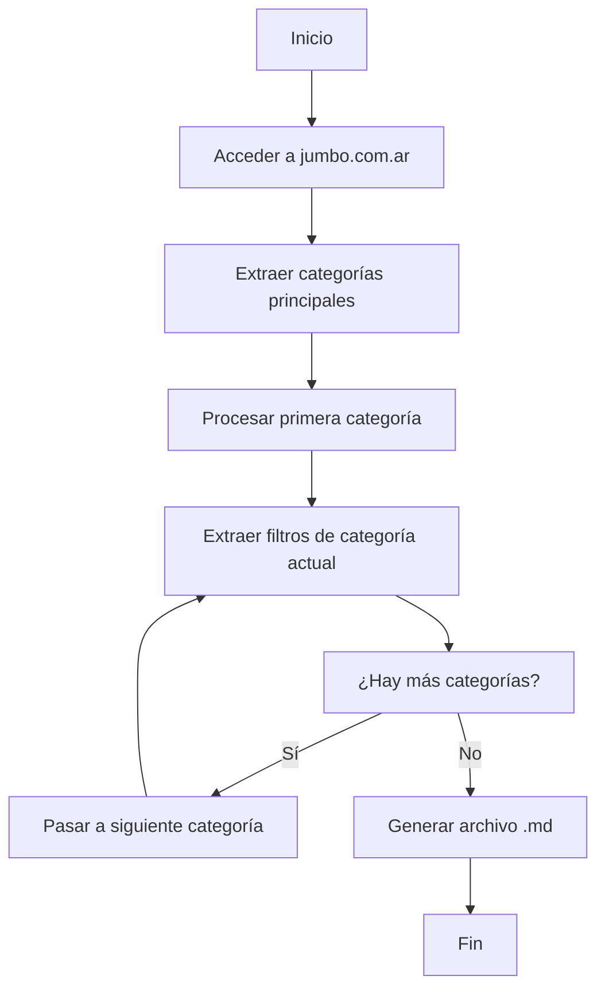

# Especificación Técnica: Script de Extracción de Filtros Jumbo

## Resumen Ejecutivo

Este documento especifica los requerimientos técnicos para desarrollar un script automatizado que extraiga las categorías y filtros del sitio web de Jumbo Argentina, generando una documentación completa en formato Markdown.

## Objetivos del Script

- **Automatización completa**: Eliminar el proceso manual de extracción de filtros
- **Consistencia**: Garantizar que todas las categorías sigan la misma estructura
- **Mantenibilidad**: Fácil actualización cuando cambien las categorías o filtros
- **Documentación**: Generar archivo .md con formato estandarizado

## Arquitectura General del Script

### Flujo Principal


## Especificaciones Técnicas

### 1. Configuración Inicial

#### Dependencias Requeridas
- **Requests**: Para hacer peticiones HTTP
- **BeautifulSoup**: Para parsear HTML
- **Selenium** (opcional): Para contenido dinámico
- **Markdown**: Para generar la documentación

#### Configuración del Navegador
```python
headers = {
    'User-Agent': 'Mozilla/5.0 (Windows NT 10.0; Win64; x64) AppleWebKit/537.36',
    'Accept': 'text/html,application/xhtml+xml,application/xml;q=0.9,*/*;q=0.8',
    'Accept-Language': 'es-AR,es;q=0.9,en;q=0.8',
    'Accept-Encoding': 'gzip, deflate, br',
    'Connection': 'keep-alive',
    'Upgrade-Insecure-Requests': '1'
}
```

### 2. Paso 1: Acceso al Sitio Principal

#### URL Base
- **URL**: `https://www.jumbo.com.ar`
- **Método**: GET
- **Headers**: Configurados para simular navegador real

#### Validación de Acceso
- Verificar código de respuesta HTTP 200
- Confirmar que el contenido se cargó correctamente
- Manejar posibles bloqueos o restricciones

### 3. Paso 2: Extracción de Categorías Principales

#### Localización de Categorías
Las categorías se encuentran en la navegación principal del sitio. Buscar:
- Elementos `<nav>` o `<ul>` con clase de navegación
- Enlaces `<a>` que contengan las URLs de categorías
- Texto de las categorías para nombrado

#### Patrón de URLs
```regex
https://www.jumbo.com.ar/[categoria-nombre]
```

#### Estructura de Datos para Categorías
```python
categories = [
    {
        'name': 'Electro',
        'url': 'https://www.jumbo.com.ar/electro',
        'filters': []  # Se llenará después
    },
    # ... más categorías
]
```

#### Validación de Categorías
- Verificar que cada URL sea accesible
- Confirmar que el nombre de categoría sea válido
- Filtrar categorías no relevantes (como "Ofertas", "Novedades", etc.)

### 4. Paso 3: Procesamiento de Categorías Individuales

#### Loop Principal
```python
for category in categories:
    print(f"Procesando categoría: {category['name']}")
    filters = extract_filters_from_category(category['url'])
    category['filters'] = filters
```

### 5. Paso 4: Extracción de Filtros por Categoría

#### Método de Extracción
Para cada categoría, acceder a su URL específica y extraer:

1. **Filtros Base** (siempre presentes):
   - Categoría
   - Sub-Categoría
   - Tipo de Producto

2. **Filtros Específicos**:
   - Buscar en elementos HTML con clases relacionadas a filtros
   - Extraer texto de opciones de filtro
   - Limpiar y validar nombres de filtros

#### Técnicas de Extracción
- **XPath/CSS Selectors**: Para localizar elementos de filtro
- **Regex**: Para extraer nombres de filtros del HTML
- **JSON Parsing**: Si los filtros están en datos estructurados

#### Ejemplo de Selectores
```python
# Posibles selectores para filtros
filter_selectors = [
    '.filter-item',
    '.facet-option',
    '.filter-option',
    '[data-filter]',
    '.search-filter'
]
```

#### Limpieza de Datos
- Remover "Rangos de precio" (como especificado)
- Eliminar duplicados
- Validar nombres de filtros
- Ordenar alfabéticamente

### 6. Manejo de Errores y Edge Cases

#### Errores HTTP
- **404**: Categoría no encontrada
- **500**: Error del servidor
- **429**: Rate limiting
- **Timeout**: Conexión lenta

#### Estrategias de Recuperación
- Reintentar con delay exponencial
- Usar proxies alternativos
- Continuar con siguiente categoría si una falla

#### Contenido Dinámico
- Detectar si la página usa JavaScript para cargar filtros
- Implementar Selenium como fallback
- Esperar carga completa antes de extraer

### 7. Generación del Archivo Markdown

#### Estructura del Archivo
```markdown
## Categorias
1. Electro: https://www.jumbo.com.ar/electro
2. Hogar: https://www.jumbo.com.ar/hogar-y-textil
...

## Filtros por Categoría

### Electro
**Total de filtros: 28**
-- FiltrosCategory
Categoría
Sub-Categoría
-- Tipo de producto
Tipo de Producto
-- Subfiltros
Capacidad de Lavado
Capacidad de Secado
...
```

#### Función de Generación
```python
def generate_markdown(categories, output_file):
    with open(output_file, 'w', encoding='utf-8') as f:
        # Generar encabezado
        # Generar lista de categorías
        # Generar secciones de filtros
        pass
```

### 8. Logging y Monitoreo

#### Niveles de Logging
- **INFO**: Progreso normal del script
- **WARNING**: Problemas menores (reintentos)
- **ERROR**: Errores críticos
- **DEBUG**: Información detallada para troubleshooting

#### Métricas a Registrar
- Tiempo total de ejecución
- Número de categorías procesadas
- Número de filtros extraídos
- Errores encontrados y resueltos

### 9. Configuración y Parámetros

#### Archivo de Configuración
```yaml
# config.yaml
site_url: "https://www.jumbo.com.ar"
output_file: "categorias_jumbo.md"
max_retries: 3
delay_between_requests: 1
timeout: 30
user_agent: "Custom User Agent String"
```

#### Parámetros de Línea de Comando
```bash
python extract_filters.py --config config.yaml --verbose
```

### 10. Consideraciones de Performance

#### Optimización
- **Conexiones persistentes**: Reutilizar conexiones HTTP
- **Multithreading**: Procesar múltiples categorías en paralelo
- **Caching**: Almacenar resultados intermedios
- **Rate limiting**: Respetar límites del servidor

#### Recursos del Sistema
- **Memoria**: Mantener bajo consumo para listas grandes
- **CPU**: Optimizar parsing de HTML
- **Disco**: Escribir resultados progresivamente

### 11. Testing y Validación

#### Casos de Prueba
- **Categorías válidas**: Verificar extracción correcta
- **Categorías inválidas**: Manejo de errores
- **Contenido dinámico**: Selenium fallback
- **Rate limiting**: Comportamiento con límites

#### Validación de Datos
- Verificar estructura del Markdown generado
- Contar filtros y comparar con expectativas
- Validar URLs de categorías
- Revisar consistencia de nombres

### 12. Mantenimiento y Actualización

#### Monitoreo Continuo
- Alertas cuando cambien las categorías
- Detección de cambios en filtros
- Actualización automática del script

#### Versionado
- Control de versiones del script
- Historial de cambios en categorías
- Backup de datos anteriores

### 13. Seguridad y Ética

#### Consideraciones Éticas
- Respetar robots.txt del sitio
- No sobrecargar el servidor
- Uso legítimo de los datos

#### Medidas de Seguridad
- Rotación de User-Agents
- Manejo de CAPTCHAs
- Detección de bloqueos

### 14. Métricas de Éxito

#### KPIs del Script
- **Tasa de éxito**: Porcentaje de categorías procesadas correctamente
- **Tiempo de ejecución**: Minutos para procesar todas las categorías
- **Precisión**: Porcentaje de filtros extraídos correctamente
- **Mantenibilidad**: Facilidad para actualizar cuando cambie el sitio

### 15. Plan de Implementación

#### Fases de Desarrollo
1. **Fase 1**: Configuración básica y acceso al sitio
2. **Fase 2**: Extracción de categorías principales
3. **Fase 3**: Extracción de filtros por categoría
4. **Fase 4**: Generación del archivo Markdown
5. **Fase 5**: Testing y validación
6. **Fase 6**: Optimización y mejoras

#### Deliverables
- Script Python completamente funcional
- Archivo de configuración
- Documentación de uso
- Tests automatizados
- Archivo Markdown generado

---

## Conclusión

Esta especificación proporciona una guía completa para desarrollar un script robusto y mantenible que automatice la extracción de filtros de Jumbo. El enfoque modular permite fácil mantenimiento y actualización cuando cambie la estructura del sitio web.

**Próximos pasos**: Implementar el script siguiendo esta especificación y probar con datos reales.

---

**Fecha**: Septiembre 2025
**Versión**: 1.0
**Autor**: GitHub Copilot
**Estado**: Especificación Completa
